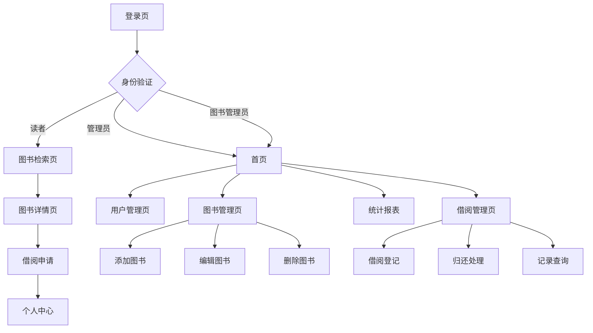

## 1. 产品概述
图书管理系统是一个为图书馆或图书管理机构设计的数字化管理平台，旨在解决传统图书管理效率低下、信息不透明等问题。系统帮助管理员高效管理图书资源，为读者提供便捷的图书检索和借阅服务，提升图书馆运营效率和用户体验。

目标用户包括图书馆管理员、图书管理员和普通读者，通过数字化手段优化图书管理流程，提高服务质量。

## 2. 核心功能

### 2.1 用户角色

| 角色 | 注册方式 | 核心权限 |
|------|----------|----------|
| 管理员 | 后台创建账号 | 图书信息管理、用户管理、借阅管理、系统设置 |
| 图书管理员 | 管理员创建 | 图书信息管理、借阅管理、读者服务 |
| 读者 | 自主注册 | 图书检索、在线借阅、个人借阅记录 |

### 2.2 功能模块

图书管理系统包含以下主要页面：
1. **首页**：系统概览、快捷导航、借阅统计图表
2. **图书管理页**：图书列表、添加图书、编辑图书信息、删除图书
3. **图书检索页**：多条件搜索、分类筛选、搜索结果展示
4. **借阅管理页**：借阅登记、归还处理、借阅记录查询
5. **用户管理页**：用户列表、权限设置、用户信息管理
6. **个人中心页**：个人信息、借阅历史、预约管理
7. **登录注册页**：用户认证、权限验证

### 2.3 页面详情

| 页面名称 | 模块名称 | 功能描述 |
|-----------|-------------|-------------|
| 首页 | 系统概览 | 显示图书总量、在借图书、注册用户等关键数据 |
| 首页 | 借阅统计 | 展示月度借阅趋势图、热门图书排行等数据可视化 |
| 首页 | 快捷操作 | 提供快速添加图书、处理借阅等常用功能入口 |
| 图书管理页 | 图书列表 | 分页展示所有图书，支持排序和基础筛选 |
| 图书管理页 | 添加图书 | 录入图书基本信息（书名、作者、ISBN、分类等） |
| 图书管理页 | 编辑图书 | 修改图书信息、更新库存状态 |
| 图书管理页 | 删除图书 | 移除图书记录，支持批量删除操作 |
| 图书检索页 | 搜索框 | 支持按书名、作者、ISBN等关键词搜索 |
| 图书检索页 | 高级筛选 | 按分类、出版社、出版年份等多条件组合筛选 |
| 图书检索页 | 搜索结果 | 展示符合条件的图书列表，显示可借状态 |
| 借阅管理页 | 借阅登记 | 扫描或输入图书ISBN，选择读者完成借阅登记 |
| 借阅管理页 | 归还处理 | 处理图书归还，计算逾期费用，更新库存状态 |
| 借阅管理页 | 借阅记录 | 查询历史借阅记录，支持按时间、用户等筛选 |
| 用户管理页 | 用户列表 | 展示所有用户信息，支持按角色筛选 |
| 用户管理页 | 权限设置 | 分配用户角色和相应权限 |
| 用户管理页 | 用户信息 | 查看和编辑用户基本信息 |
| 个人中心页 | 个人信息 | 显示和编辑个人资料 |
| 个人中心页 | 借阅历史 | 查看个人借阅记录和当前借阅状态 |
| 个人中心页 | 预约管理 | 管理图书预约和取消预约 |
| 登录注册页 | 用户登录 | 输入用户名密码进行身份验证 |
| 登录注册页 | 用户注册 | 新用户注册账号，填写基本信息 |

## 3. 核心流程

### 管理员流程
管理员登录系统后，可以进行图书信息管理、用户管理和系统配置。管理员负责创建图书管理员账号，设置系统参数，查看各类统计报表。

### 图书管理员流程
图书管理员登录后，主要进行图书信息维护和借阅管理。可以添加新图书，处理读者借阅和归还请求，管理图书库存。

### 读者流程
读者注册登录后，可以搜索图书、查看图书详情、在线预约借阅。在个人中心查看借阅历史和当前借阅状态。

## 4. 用户界面设计

### 4.1 设计风格
- **主色调**：深蓝色（#1e40af）作为主色，浅灰色（#f8fafc）作为背景
- **按钮样式**：圆角矩形设计，主要操作为实心按钮，次要操作为边框按钮
- **字体选择**：系统默认字体，标题16-18px，正文14px，小字12px
- **布局风格**：左侧导航栏 + 右侧内容区的经典管理后台布局
- **图标风格**：使用简洁的线性图标，保持视觉一致性

### 4.2 页面设计概览

| 页面名称 | 模块名称 | UI元素 |
|-----------|-------------|-------------|
| 首页 | 顶部导航 | 深蓝色顶部栏，包含系统logo、用户信息和退出按钮 |
| 首页 | 左侧菜单 | 白色背景，图标+文字形式，当前选中项高亮显示 |
| 首页 | 数据卡片 | 彩色渐变卡片展示关键数据，包含图标和数字 |
| 首页 | 图表区域 | 使用ECharts展示借阅趋势，支持图表切换 |
| 图书管理页 | 搜索栏 | 顶部搜索框，支持快速搜索和高级筛选切换 |
| 图书管理页 | 数据表格 | 斑马纹表格，每行显示图书信息和操作按钮 |
| 图书管理页 | 分页控件 | 底部居中分页，显示总记录数和每页条数选择 |
| 图书检索页 | 搜索面板 | 左侧搜索条件面板，右侧搜索结果列表 |
| 借阅管理页 | 操作面板 | 顶部快速操作区，包含借阅和归还入口 |
| 借阅管理页 | 记录表格 | 显示借阅记录，包含状态标识和逾期提醒 |

### 4.3 响应式设计
系统采用桌面端优先的设计策略，确保在PC端提供最佳用户体验。同时支持平板设备自适应，在移动端提供简化版界面，核心功能可通过手机浏览器访问。

### 4.4 数据可视化
系统包含多种数据可视化图表：
- **借阅趋势图**：折线图展示月度借阅量变化
- **分类占比图**：饼图显示各类图书占比
- **热门图书排行**：柱状图展示借阅量top10图书
- **用户活跃度**：面积图展示用户注册和活跃趋势