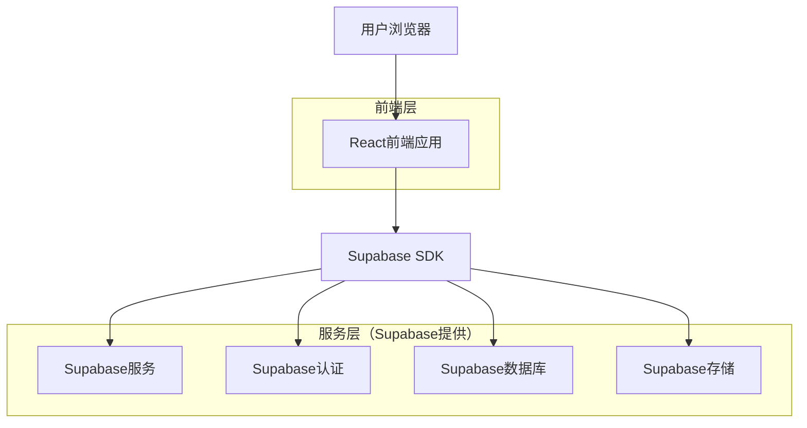
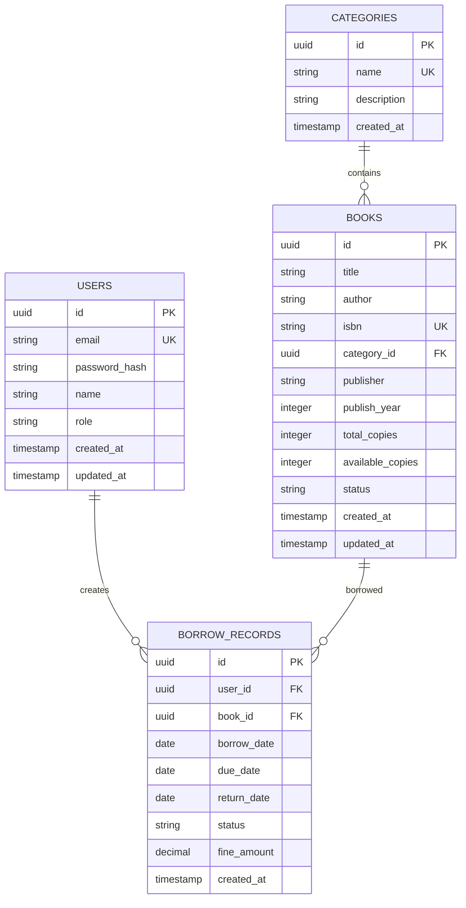

## 1. 架构设计



## 2. 技术描述

- **前端**: React@18 + TypeScript + TailwindCSS@3 + Vite
- **初始化工具**: vite-init
- **后端**: Supabase (BaaS)
- **数据库**: Supabase PostgreSQL
- **主要依赖**:
  - @supabase/supabase-js: Supabase客户端SDK
  - react-router-dom: 路由管理
  - axios: HTTP请求
  - recharts: 数据可视化图表
  - lucide-react: 图标库
  - date-fns: 日期处理

## 3. 路由定义

| 路由 | 用途 |
|-------|---------|
| / | 首页，系统概览和快捷导航 |
| /login | 登录页面，用户身份验证 |
| /register | 注册页面，新用户注册 |
| /books | 图书管理页面，图书CRUD操作 |
| /books/search | 图书检索页面，多条件搜索 |
| /books/add | 添加图书页面 |
| /books/edit/:id | 编辑图书页面 |
| /borrow | 借阅管理页面，借阅归还处理 |
| /users | 用户管理页面，用户权限管理 |
| /profile | 个人中心页面，个人信息和借阅历史 |
| /statistics | 统计报表页面，数据可视化 |

## 4. API定义

### 4.1 认证相关API

**用户登录**
```
POST /auth/v1/token?grant_type=password
```

请求参数:
| 参数名 | 参数类型 | 是否必需 | 描述 |
|-----------|-------------|-------------|-------------|
| email | string | 是 | 用户邮箱 |
| password | string | 是 | 用户密码 |

响应示例:
```json
{
  "access_token": "eyJhbGciOiJIUzI1NiIsInR5cCI6IkpXVCJ9...",
  "token_type": "bearer",
  "expires_in": 3600,
  "refresh_token": "-QllhwXssfD3FJG5bVJcAw",
  "user": {
    "id": "user_id",
    "email": "user@example.com",
    "role": "admin"
  }
}
```

**用户注册**
```
POST /auth/v1/signup
```

请求参数:
| 参数名 | 参数类型 | 是否必需 | 描述 |
|-----------|-------------|-------------|-------------|
| email | string | 是 | 用户邮箱 |
| password | string | 是 | 用户密码 |
| name | string | 是 | 用户姓名 |
| role | string | 否 | 用户角色，默认为reader |

### 4.2 图书相关API

**获取图书列表**
```
GET /rest/v1/books
```

查询参数:
| 参数名 | 参数类型 | 是否必需 | 描述 |
|-----------|-------------|-------------|-------------|
| page | number | 否 | 页码，默认1 |
| limit | number | 否 | 每页条数，默认20 |
| search | string | 否 | 搜索关键词 |
| category | string | 否 | 图书分类 |
| status | string | 否 | 图书状态 |

**添加图书**
```
POST /rest/v1/books
```

请求体:
```json
{
  "title": "JavaScript高级程序设计",
  "author": "Nicholas C. Zakas",
  "isbn": "9787115275790",
  "category": "编程技术",
  "publisher": "人民邮电出版社",
  "publish_year": 2012,
  "total_copies": 5,
  "available_copies": 5
}
```

**更新图书**
```
PATCH /rest/v1/books?id=eq.{id}
```

**删除图书**
```
DELETE /rest/v1/books?id=eq.{id}
```

### 4.3 借阅相关API

**创建借阅记录**
```
POST /rest/v1/borrow_records
```

请求体:
```json
{
  "user_id": "user_id",
  "book_id": "book_id",
  "borrow_date": "2024-01-15",
  "due_date": "2024-02-15"
}
```

**更新借阅状态（归还）**
```
PATCH /rest/v1/borrow_records?id=eq.{id}
```

请求体:
```json
{
  "return_date": "2024-01-25",
  "status": "returned",
  "fine_amount": 0
}
```

## 5. 数据模型

### 5.1 数据模型定义



### 5.2 数据定义语言

**用户表 (users)**
```sql
-- 创建用户表
CREATE TABLE users (
  id UUID PRIMARY KEY DEFAULT gen_random_uuid(),
  email VARCHAR(255) UNIQUE NOT NULL,
  password_hash VARCHAR(255) NOT NULL,
  name VARCHAR(100) NOT NULL,
  role VARCHAR(20) DEFAULT 'reader' CHECK (role IN ('admin', 'librarian', 'reader')),
  created_at TIMESTAMP WITH TIME ZONE DEFAULT NOW(),
  updated_at TIMESTAMP WITH TIME ZONE DEFAULT NOW()
);

-- 创建索引
CREATE INDEX idx_users_email ON users(email);
CREATE INDEX idx_users_role ON users(role);
```

**图书分类表 (categories)**
```sql
-- 创建分类表
CREATE TABLE categories (
  id UUID PRIMARY KEY DEFAULT gen_random_uuid(),
  name VARCHAR(100) UNIQUE NOT NULL,
  description TEXT,
  created_at TIMESTAMP WITH TIME ZONE DEFAULT NOW()
);

-- 初始化数据
INSERT INTO categories (name, description) VALUES
('文学小说', '各类文学作品'),
('科学技术', '科学技术类图书'),
('历史传记', '历史和人物传记'),
('经济管理', '经济和管理类图书'),
('艺术设计', '艺术和设计相关图书');
```

**图书表 (books)**
```sql
-- 创建图书表
CREATE TABLE books (
  id UUID PRIMARY KEY DEFAULT gen_random_uuid(),
  title VARCHAR(200) NOT NULL,
  author VARCHAR(100) NOT NULL,
  isbn VARCHAR(20) UNIQUE NOT NULL,
  category_id UUID REFERENCES categories(id),
  publisher VARCHAR(100),
  publish_year INTEGER,
  total_copies INTEGER DEFAULT 1 CHECK (total_copies > 0),
  available_copies INTEGER DEFAULT 1 CHECK (available_copies >= 0),
  status VARCHAR(20) DEFAULT 'available' CHECK (status IN ('available', 'borrowed', 'damaged', 'lost')),
  created_at TIMESTAMP WITH TIME ZONE DEFAULT NOW(),
  updated_at TIMESTAMP WITH TIME ZONE DEFAULT NOW()
);

-- 创建索引
CREATE INDEX idx_books_title ON books(title);
CREATE INDEX idx_books_author ON books(author);
CREATE INDEX idx_books_isbn ON books(isbn);
CREATE INDEX idx_books_category ON books(category_id);
CREATE INDEX idx_books_status ON books(status);
```

**借阅记录表 (borrow_records)**
```sql
-- 创建借阅记录表
CREATE TABLE borrow_records (
  id UUID PRIMARY KEY DEFAULT gen_random_uuid(),
  user_id UUID REFERENCES users(id) NOT NULL,
  book_id UUID REFERENCES books(id) NOT NULL,
  borrow_date DATE NOT NULL,
  due_date DATE NOT NULL,
  return_date DATE,
  status VARCHAR(20) DEFAULT 'borrowed' CHECK (status IN ('borrowed', 'returned', 'overdue')),
  fine_amount DECIMAL(10,2) DEFAULT 0 CHECK (fine_amount >= 0),
  created_at TIMESTAMP WITH TIME ZONE DEFAULT NOW(),
  updated_at TIMESTAMP WITH TIME ZONE DEFAULT NOW()
);

-- 创建索引
CREATE INDEX idx_borrow_records_user_id ON borrow_records(user_id);
CREATE INDEX idx_borrow_records_book_id ON borrow_records(book_id);
CREATE INDEX idx_borrow_records_status ON borrow_records(status);
CREATE INDEX idx_borrow_records_due_date ON borrow_records(due_date);
```

### 5.3 Supabase权限配置

```sql
-- 基本权限设置
GRANT SELECT ON users TO anon;
GRANT SELECT ON categories TO anon;
GRANT SELECT ON books TO anon;
GRANT SELECT ON borrow_records TO anon;

-- 认证用户权限
GRANT ALL PRIVILEGES ON users TO authenticated;
GRANT ALL PRIVILEGES ON categories TO authenticated;
GRANT ALL PRIVILEGES ON books TO authenticated;
GRANT ALL PRIVILEGES ON borrow_records TO authenticated;

-- RLS (Row Level Security) 策略
ALTER TABLE users ENABLE ROW LEVEL SECURITY;
ALTER TABLE books ENABLE ROW LEVEL SECURITY;
ALTER TABLE borrow_records ENABLE ROW LEVEL SECURITY;

-- 用户只能查看和更新自己的信息
CREATE POLICY "用户查看自己的信息" ON users FOR SELECT
  USING (auth.uid() = id);

CREATE POLICY "用户更新自己的信息" ON users FOR UPDATE
  USING (auth.uid() = id);

-- 图书管理员和管理员可以管理所有图书
CREATE POLICY "图书管理员管理图书" ON books FOR ALL
  USING (auth.jwt() ->> 'role' IN ('admin', 'librarian'));

-- 读者可以查看图书
CREATE POLICY "读者查看图书" ON books FOR SELECT
  USING (true);

-- 用户可以查看自己的借阅记录
CREATE POLICY "用户查看自己的借阅记录" ON borrow_records FOR SELECT
  USING (auth.uid() = user_id);

-- 图书管理员可以管理所有借阅记录
CREATE POLICY "图书管理员管理借阅记录" ON borrow_records FOR ALL
  USING (auth.jwt() ->> 'role' IN ('admin', 'librarian'));
```

## 6. 测试策略

### 6.1 单元测试
- **组件测试**: 使用React Testing Library测试React组件
- **工具函数测试**: 测试日期处理、数据格式化等工具函数
- **API测试**: 使用MSW模拟API响应测试数据获取逻辑

### 6.2 集成测试
- **用户流程测试**: 测试完整的用户注册、登录、借阅流程
- **权限测试**: 验证不同角色用户的权限控制
- **数据一致性测试**: 验证数据库操作的数据一致性

### 6.3 性能测试
- **加载性能**: 测试页面首次加载时间和资源大小
- **响应性能**: 测试API请求的响应时间
- **并发测试**: 测试多用户同时操作的系统稳定性